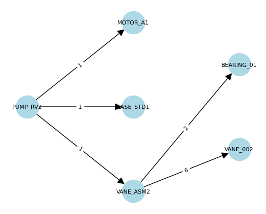

# bom


<!-- WARNING: THIS FILE WAS AUTOGENERATED! DO NOT EDIT! -->

## Developer Guide

### Installation

Install latest from the GitHub
[repository](https://github.com/janhesse53/bom):

``` sh
$ pip install git+https://github.com/janhesse53/bom.git
```

### Documentation

Documentation can be found hosted on this GitHub
[repository](https://github.com/janhesse53/bom)’s
[pages](https://janhesse53.github.io/bom/).

## How to use

``` python
df, df_attributes = get_sample_data()
```

Build the complete graph from df (optionally merging df_attributes):

``` python
G = build_complete_graph(df, df_attributes)

# Let's confirm the number of nodes (20 unique items)
print("Number of nodes:", G.number_of_nodes())
print("Number of edges:", G.number_of_edges())
```

    Number of nodes: 20
    Number of edges: 21

Often, we only want to visualize **one** product (like `PUMP_RV2`) and
its sub-components:

``` python
sub_g = select_subg_by_root(G, 'PUMP_RV2')
sub_g.nodes()
```

    NodeView(('MOTOR_A1', 'CASE_STD1', 'PUMP_RV2', 'BEARING_01', 'VANE_002', 'VANE_ASM2'))

``` python
sub_g = add_levels(sub_g)
[(n[0],n[1]['level']) for n in sub_g.nodes(data=True)]
```

    [('MOTOR_A1', 1),
     ('CASE_STD1', 1),
     ('PUMP_RV2', 0),
     ('BEARING_01', 2),
     ('VANE_002', 2),
     ('VANE_ASM2', 1)]

``` python
plot_graph(sub_g, layout='multipartite', figsize=(5,4), font_size=8)
```



### Graph Querying

With the **complete graph**, we can answer many questions:

**Which products contain a certain part?**

``` python
get_all_predecessors(G, 'BEARING_01')
```

    ['VANE_ASM1', 'VANE_ASM2', 'PUMP_RV1', 'PUMP_RV2']

**All sub-components of a certain product?**

``` python
get_all_successors(G, 'PUMP_CL1')
```

    ['MOTOR_A1', 'CASE_CL1', 'CLAW_ASM1', 'CLAW_001', 'BEARING_02']

**Edge attributes** (like `quantity`):

``` python
for (u,v,d) in G.edges(data=True):
  if 'quantity' in d and d['quantity'] > 1:
      print(u, '-->', v, '[qty=', d['quantity'], ']')
```

    VANE_ASM1 --> VANE_001 [qty= 6 ]
    VANE_ASM1 --> BEARING_01 [qty= 2 ]
    VANE_ASM2 --> VANE_002 [qty= 6 ]
    VANE_ASM2 --> BEARING_01 [qty= 2 ]
    SCREW_ASM1 --> SCREW_001 [qty= 2 ]
    SCREW_ASM1 --> BEARING_02 [qty= 4 ]
    CLAW_ASM1 --> CLAW_001 [qty= 2 ]
    CLAW_ASM1 --> BEARING_02 [qty= 4 ]

**Node attributes** (like `component_type`, `cost`):

``` python
# Example: Print the cost of each node if it exists
for n, attrs in G.nodes(data=True):
  if 'cost' in attrs:
      print(n, 'cost=', attrs['cost'])
```

    PUMP_RV1 cost= 2500
    MOTOR_A1 cost= 800
    CASE_STD1 cost= 400
    VANE_ASM1 cost= 300
    OIL_SYSTEM1 cost= 150
    VANE_001 cost= 50
    BEARING_01 cost= 30
    PUMP_RV2 cost= 2300
    VANE_ASM2 cost= 280
    VANE_002 cost= 65
    PUMP_SC1 cost= 3000
    MOTOR_B1 cost= 1000
    CASE_SC1 cost= 600
    SCREW_ASM1 cost= 450
    SCREW_001 cost= 150
    BEARING_02 cost= 45
    PUMP_CL1 cost= 2800
    CASE_CL1 cost= 450
    CLAW_ASM1 cost= 400
    CLAW_001 cost= 140
