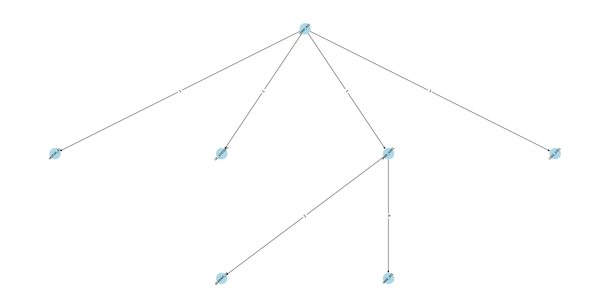

# core


<!-- WARNING: THIS FILE WAS AUTOGENERATED! DO NOT EDIT! -->

------------------------------------------------------------------------

<a href="https://github.com/janhesse53/bom/blob/main/bom/core.py#L16"
target="_blank" style="float:right; font-size:smaller">source</a>

### get_sample_data

>  get_sample_data ()

*Return sample BOM data (df) and item attributes (df_attributes) for
demonstration purposes.*

``` python
df, df_attributes = get_sample_data()
```

At this point, we have:

- `df` – Bill of Materials table (predecessor, successor, quantity)
- `df_attributes` – Item attributes table (component_type, cost, etc.)

------------------------------------------------------------------------

## Core Functions

We create one large directed graph containing **all** nodes and edges
from `df`. For node attributes, we can optionally merge data from
`df_attributes`.

------------------------------------------------------------------------

<a href="https://github.com/janhesse53/bom/blob/main/bom/core.py#L134"
target="_blank" style="float:right; font-size:smaller">source</a>

### build_complete_graph

>  build_complete_graph (df, df_attributes=None)

*Build a directed graph (DiGraph) from the BOM DataFrame. Optionally
enrich nodes with attributes from df_attributes.*

``` python
G = build_complete_graph(df, df_attributes)

print("Number of nodes:", G.number_of_nodes())
print("Number of edges:", G.number_of_edges())
```

    Number of nodes: 20
    Number of edges: 21

If we want to see which assemblies or products contain a given part, we
can **move upwards** in the graph (following edges backwards).

------------------------------------------------------------------------

<a href="https://github.com/janhesse53/bom/blob/main/bom/core.py#L161"
target="_blank" style="float:right; font-size:smaller">source</a>

### get_all_predecessors

>  get_all_predecessors (G, node_id)

*Return a list of all predecessors (ancestors) of `node_id`. This
effectively finds all assemblies or parent items that contain
`node_id`.*

Now, we can answer questions like: \> Where is component ‘MOTOR_A1’
installed?

``` python
get_all_predecessors(G, 'MOTOR_A1')
```

    ['PUMP_RV1', 'PUMP_RV2', 'PUMP_CL1']

Similarly, we can move **down** the graph to find all sub-components or
child items of a given product or assembly.

------------------------------------------------------------------------

<a href="https://github.com/janhesse53/bom/blob/main/bom/core.py#L177"
target="_blank" style="float:right; font-size:smaller">source</a>

### get_all_successors

>  get_all_successors (G, node_id)

*Return a list of all successors (descendants) of `node_id`. This
effectively finds the complete set of parts that make up `node_id`.*

Now, we can answer questions like: \> What component are installed in
‘PUMP_RV1’?

``` python
get_all_successors(G, 'PUMP_RV1')
```

    ['MOTOR_A1', 'CASE_STD1', 'VANE_ASM1', 'OIL_SYSTEM1', 'VANE_001', 'BEARING_01']

We can select a sub_graph by giving a root node and then searching for
all successors.

------------------------------------------------------------------------

<a href="https://github.com/janhesse53/bom/blob/main/bom/core.py#L193"
target="_blank" style="float:right; font-size:smaller">source</a>

### select_subg_by_root

>  select_subg_by_root (G, root_id)

``` python
sub_g = select_subg_by_root(G, 'PUMP_RV1')
sub_g.nodes()
```

    NodeView(('BEARING_01', 'VANE_001', 'CASE_STD1', 'MOTOR_A1', 'VANE_ASM1', 'PUMP_RV1', 'OIL_SYSTEM1'))

For a **multipartite** (hierarchical) layout in NetworkX, each node must
have a `level` attribute. The “level” is typically “0” for a root
product, “1” for its direct children, “2” for those children’s children,
etc. This function automatically detects the root(s) (any node with no
incoming edges) and assigns levels by breadth-first search.

------------------------------------------------------------------------

<a href="https://github.com/janhesse53/bom/blob/main/bom/core.py#L199"
target="_blank" style="float:right; font-size:smaller">source</a>

### get_all_roots

>  get_all_roots (G)

*Returns a list of nodes with no ingoing edges (root_nodes)*

------------------------------------------------------------------------

<a href="https://github.com/janhesse53/bom/blob/main/bom/core.py#L204"
target="_blank" style="float:right; font-size:smaller">source</a>

### add_levels

>  add_levels (G)

*Calculate levels starting from root*

``` python
sub_g = add_levels(sub_g)
[(n[0],n[1]['level']) for n in sub_g.nodes(data=True)]
```

    [('BEARING_01', 2),
     ('VANE_001', 2),
     ('CASE_STD1', 1),
     ('MOTOR_A1', 1),
     ('VANE_ASM1', 1),
     ('PUMP_RV1', 0),
     ('OIL_SYSTEM1', 1)]

The depth of the bill of materials can give us information about the
depth of added value per product.

``` python
max([n[1]['level'] for n in sub_g.nodes(data=True)])
```

    2

## Visualizing

Finally, we create a plotting function that can handle:

- Either a **multipartite** layout (if levels are assigned)
- Or a **kamada_kawai** layout (force-directed)

We also display edge attributes (`quantity`), and we allow parameter
overrides (font size, node size, color, etc.) for quick styling changes.

------------------------------------------------------------------------

<a href="https://github.com/janhesse53/bom/blob/main/bom/core.py#L224"
target="_blank" style="float:right; font-size:smaller">source</a>

### plot_graph

>  plot_graph (G, layout='multipartite', figsize=(24, 12), font_size=8,
>                  node_size=1000, node_color='lightblue',
>                  direction='top_to_bottom', label_rotation=45)

*Plot a graph with specified layout and styling.*

<table>
<colgroup>
<col style="width: 6%" />
<col style="width: 25%" />
<col style="width: 34%" />
<col style="width: 34%" />
</colgroup>
<thead>
<tr>
<th></th>
<th><strong>Type</strong></th>
<th><strong>Default</strong></th>
<th><strong>Details</strong></th>
</tr>
</thead>
<tbody>
<tr>
<td>G</td>
<td></td>
<td></td>
<td>NetworkX graph</td>
</tr>
<tr>
<td>layout</td>
<td>str</td>
<td>multipartite</td>
<td>‘multipartite’ or ‘kamada_kawai’</td>
</tr>
<tr>
<td>figsize</td>
<td>tuple</td>
<td>(24, 12)</td>
<td></td>
</tr>
<tr>
<td>font_size</td>
<td>int</td>
<td>8</td>
<td></td>
</tr>
<tr>
<td>node_size</td>
<td>int</td>
<td>1000</td>
<td></td>
</tr>
<tr>
<td>node_color</td>
<td>str</td>
<td>lightblue</td>
<td></td>
</tr>
<tr>
<td>direction</td>
<td>str</td>
<td>top_to_bottom</td>
<td>if layout is multipartite the direction is top to bottom, to rotate
set to None</td>
</tr>
<tr>
<td>label_rotation</td>
<td>int</td>
<td>45</td>
<td>Rotation angle for node labels (in degrees)</td>
</tr>
</tbody>
</table>

``` python
plot_graph(sub_g)
```



## Creating a binary matrix

We can also create a binary matrix, with endproducts in the index and
parts as columns. This is very helpful, for further analysis, like
similarity searches and product clustering.

------------------------------------------------------------------------

<a href="https://github.com/janhesse53/bom/blob/main/bom/core.py#L258"
target="_blank" style="float:right; font-size:smaller">source</a>

### create_binary_matrix

>  create_binary_matrix (G, root_nodes=None)

*Creates a binary matrix with endproducts as indices and parts as
columns*

``` python
b_matrix = create_binary_matrix(G)
b_matrix
```

<div>
<style scoped>
    .dataframe tbody tr th:only-of-type {
        vertical-align: middle;
    }
&#10;    .dataframe tbody tr th {
        vertical-align: top;
    }
&#10;    .dataframe thead th {
        text-align: right;
    }
</style>

<table class="dataframe" data-quarto-postprocess="true" data-border="1">
<thead>
<tr style="text-align: right;">
<th data-quarto-table-cell-role="th">parts</th>
<th data-quarto-table-cell-role="th">BEARING_01</th>
<th data-quarto-table-cell-role="th">BEARING_02</th>
<th data-quarto-table-cell-role="th">CASE_CL1</th>
<th data-quarto-table-cell-role="th">CASE_SC1</th>
<th data-quarto-table-cell-role="th">CASE_STD1</th>
<th data-quarto-table-cell-role="th">CLAW_001</th>
<th data-quarto-table-cell-role="th">CLAW_ASM1</th>
<th data-quarto-table-cell-role="th">MOTOR_A1</th>
<th data-quarto-table-cell-role="th">MOTOR_B1</th>
<th data-quarto-table-cell-role="th">OIL_SYSTEM1</th>
<th data-quarto-table-cell-role="th">SCREW_001</th>
<th data-quarto-table-cell-role="th">SCREW_ASM1</th>
<th data-quarto-table-cell-role="th">VANE_001</th>
<th data-quarto-table-cell-role="th">VANE_002</th>
<th data-quarto-table-cell-role="th">VANE_ASM1</th>
<th data-quarto-table-cell-role="th">VANE_ASM2</th>
</tr>
<tr>
<th data-quarto-table-cell-role="th">head</th>
<th data-quarto-table-cell-role="th"></th>
<th data-quarto-table-cell-role="th"></th>
<th data-quarto-table-cell-role="th"></th>
<th data-quarto-table-cell-role="th"></th>
<th data-quarto-table-cell-role="th"></th>
<th data-quarto-table-cell-role="th"></th>
<th data-quarto-table-cell-role="th"></th>
<th data-quarto-table-cell-role="th"></th>
<th data-quarto-table-cell-role="th"></th>
<th data-quarto-table-cell-role="th"></th>
<th data-quarto-table-cell-role="th"></th>
<th data-quarto-table-cell-role="th"></th>
<th data-quarto-table-cell-role="th"></th>
<th data-quarto-table-cell-role="th"></th>
<th data-quarto-table-cell-role="th"></th>
<th data-quarto-table-cell-role="th"></th>
</tr>
</thead>
<tbody>
<tr>
<td data-quarto-table-cell-role="th">PUMP_CL1</td>
<td>0</td>
<td>1</td>
<td>1</td>
<td>0</td>
<td>0</td>
<td>1</td>
<td>1</td>
<td>1</td>
<td>0</td>
<td>0</td>
<td>0</td>
<td>0</td>
<td>0</td>
<td>0</td>
<td>0</td>
<td>0</td>
</tr>
<tr>
<td data-quarto-table-cell-role="th">PUMP_RV1</td>
<td>1</td>
<td>0</td>
<td>0</td>
<td>0</td>
<td>1</td>
<td>0</td>
<td>0</td>
<td>1</td>
<td>0</td>
<td>1</td>
<td>0</td>
<td>0</td>
<td>1</td>
<td>0</td>
<td>1</td>
<td>0</td>
</tr>
<tr>
<td data-quarto-table-cell-role="th">PUMP_RV2</td>
<td>1</td>
<td>0</td>
<td>0</td>
<td>0</td>
<td>1</td>
<td>0</td>
<td>0</td>
<td>1</td>
<td>0</td>
<td>0</td>
<td>0</td>
<td>0</td>
<td>0</td>
<td>1</td>
<td>0</td>
<td>1</td>
</tr>
<tr>
<td data-quarto-table-cell-role="th">PUMP_SC1</td>
<td>0</td>
<td>1</td>
<td>0</td>
<td>1</td>
<td>0</td>
<td>0</td>
<td>0</td>
<td>0</td>
<td>1</td>
<td>0</td>
<td>1</td>
<td>1</td>
<td>0</td>
<td>0</td>
<td>0</td>
<td>0</td>
</tr>
</tbody>
</table>

</div>

## Creating a matrix for parts utilisation

We can also create a matrix, with endproducts in the index and parts as
columns and the values representing some value (for example cost or
quantity or something else). This is very helpful, for further analysis,
like similarity searches and product clustering.

``` python
G.out_edges(['PUMP_RV1'], data=True)
```

    OutEdgeDataView([('PUMP_RV1', 'MOTOR_A1', {'quantity': 1}), ('PUMP_RV1', 'CASE_STD1', {'quantity': 1}), ('PUMP_RV1', 'VANE_ASM1', {'quantity': 1}), ('PUMP_RV1', 'OIL_SYSTEM1', {'quantity': 1})])

``` python
elist = [[u, v, data['quantity']] for u,v,data in G.out_edges(['PUMP_RV1'], data=True)]
elist
```

    [['PUMP_RV1', 'MOTOR_A1', 1],
     ['PUMP_RV1', 'CASE_STD1', 1],
     ['PUMP_RV1', 'VANE_ASM1', 1],
     ['PUMP_RV1', 'OIL_SYSTEM1', 1]]

------------------------------------------------------------------------

<a href="https://github.com/janhesse53/bom/blob/main/bom/core.py#L268"
target="_blank" style="float:right; font-size:smaller">source</a>

### get_all_successor_edges

>  get_all_successor_edges (G, node_id, attr='quantity', default=None)

*Return a list of all edge pairs for `node_id` with the specified
attribute.*

------------------------------------------------------------------------

<a href="https://github.com/janhesse53/bom/blob/main/bom/core.py#L287"
target="_blank" style="float:right; font-size:smaller">source</a>

### get_all_predecessor_edges

>  get_all_predecessor_edges (G, node_id, attr='quantity', default=None)

*Return a list of all predecessor edges for `node_id` with the specified
attribute.*

``` python
get_all_successor_edges(G, 'PUMP_RV1')
```

    [['PUMP_RV1', 'PUMP_RV1', 'MOTOR_A1', 1],
     ['PUMP_RV1', 'PUMP_RV1', 'CASE_STD1', 1],
     ['PUMP_RV1', 'PUMP_RV1', 'VANE_ASM1', 1],
     ['PUMP_RV1', 'PUMP_RV1', 'OIL_SYSTEM1', 1],
     ['PUMP_RV1', 'VANE_ASM1', 'VANE_001', 6],
     ['PUMP_RV1', 'VANE_ASM1', 'BEARING_01', 2]]

``` python
get_all_successor_edges(G, 'BEARING_01')
```

    []

``` python
get_all_predecessor_edges(G, 'PUMP_RV1')
```

    []

``` python
get_all_predecessor_edges(G, 'BEARING_01')
```

    [['BEARING_01', 'VANE_ASM1', 'BEARING_01', 2],
     ['BEARING_01', 'VANE_ASM2', 'BEARING_01', 2],
     ['BEARING_01', 'PUMP_RV1', 'VANE_ASM1', 1],
     ['BEARING_01', 'PUMP_RV2', 'VANE_ASM2', 1]]

``` python
dfs = [pd.DataFrame(get_all_successor_edges(G, root)) for root in get_all_roots(G)]
dfs[:2]
```

    [          0          1            2  3
     0  PUMP_RV1   PUMP_RV1     MOTOR_A1  1
     1  PUMP_RV1   PUMP_RV1    CASE_STD1  1
     2  PUMP_RV1   PUMP_RV1    VANE_ASM1  1
     3  PUMP_RV1   PUMP_RV1  OIL_SYSTEM1  1
     4  PUMP_RV1  VANE_ASM1     VANE_001  6
     5  PUMP_RV1  VANE_ASM1   BEARING_01  2,
               0          1           2  3
     0  PUMP_RV2   PUMP_RV2    MOTOR_A1  1
     1  PUMP_RV2   PUMP_RV2   CASE_STD1  1
     2  PUMP_RV2   PUMP_RV2   VANE_ASM2  1
     3  PUMP_RV2  VANE_ASM2    VANE_002  6
     4  PUMP_RV2  VANE_ASM2  BEARING_01  2]

``` python
final_df = pd.concat(dfs)
final_df.head()
```

<div>
<style scoped>
    .dataframe tbody tr th:only-of-type {
        vertical-align: middle;
    }
&#10;    .dataframe tbody tr th {
        vertical-align: top;
    }
&#10;    .dataframe thead th {
        text-align: right;
    }
</style>

<table class="dataframe" data-quarto-postprocess="true" data-border="1">
<thead>
<tr style="text-align: right;">
<th data-quarto-table-cell-role="th"></th>
<th data-quarto-table-cell-role="th">0</th>
<th data-quarto-table-cell-role="th">1</th>
<th data-quarto-table-cell-role="th">2</th>
<th data-quarto-table-cell-role="th">3</th>
</tr>
</thead>
<tbody>
<tr>
<td data-quarto-table-cell-role="th">0</td>
<td>PUMP_RV1</td>
<td>PUMP_RV1</td>
<td>MOTOR_A1</td>
<td>1</td>
</tr>
<tr>
<td data-quarto-table-cell-role="th">1</td>
<td>PUMP_RV1</td>
<td>PUMP_RV1</td>
<td>CASE_STD1</td>
<td>1</td>
</tr>
<tr>
<td data-quarto-table-cell-role="th">2</td>
<td>PUMP_RV1</td>
<td>PUMP_RV1</td>
<td>VANE_ASM1</td>
<td>1</td>
</tr>
<tr>
<td data-quarto-table-cell-role="th">3</td>
<td>PUMP_RV1</td>
<td>PUMP_RV1</td>
<td>OIL_SYSTEM1</td>
<td>1</td>
</tr>
<tr>
<td data-quarto-table-cell-role="th">4</td>
<td>PUMP_RV1</td>
<td>VANE_ASM1</td>
<td>VANE_001</td>
<td>6</td>
</tr>
</tbody>
</table>

</div>

``` python
final_df.columns = ['head', 'parent', 'child', 'quantity']
final_df.head()
```

<div>
<style scoped>
    .dataframe tbody tr th:only-of-type {
        vertical-align: middle;
    }
&#10;    .dataframe tbody tr th {
        vertical-align: top;
    }
&#10;    .dataframe thead th {
        text-align: right;
    }
</style>

<table class="dataframe" data-quarto-postprocess="true" data-border="1">
<thead>
<tr style="text-align: right;">
<th data-quarto-table-cell-role="th"></th>
<th data-quarto-table-cell-role="th">head</th>
<th data-quarto-table-cell-role="th">parent</th>
<th data-quarto-table-cell-role="th">child</th>
<th data-quarto-table-cell-role="th">quantity</th>
</tr>
</thead>
<tbody>
<tr>
<td data-quarto-table-cell-role="th">0</td>
<td>PUMP_RV1</td>
<td>PUMP_RV1</td>
<td>MOTOR_A1</td>
<td>1</td>
</tr>
<tr>
<td data-quarto-table-cell-role="th">1</td>
<td>PUMP_RV1</td>
<td>PUMP_RV1</td>
<td>CASE_STD1</td>
<td>1</td>
</tr>
<tr>
<td data-quarto-table-cell-role="th">2</td>
<td>PUMP_RV1</td>
<td>PUMP_RV1</td>
<td>VANE_ASM1</td>
<td>1</td>
</tr>
<tr>
<td data-quarto-table-cell-role="th">3</td>
<td>PUMP_RV1</td>
<td>PUMP_RV1</td>
<td>OIL_SYSTEM1</td>
<td>1</td>
</tr>
<tr>
<td data-quarto-table-cell-role="th">4</td>
<td>PUMP_RV1</td>
<td>VANE_ASM1</td>
<td>VANE_001</td>
<td>6</td>
</tr>
</tbody>
</table>

</div>

``` python
final_df.pivot_table(index='head', columns='child', values='quantity', aggfunc='sum')
```

<div>
<style scoped>
    .dataframe tbody tr th:only-of-type {
        vertical-align: middle;
    }
&#10;    .dataframe tbody tr th {
        vertical-align: top;
    }
&#10;    .dataframe thead th {
        text-align: right;
    }
</style>

<table class="dataframe" data-quarto-postprocess="true" data-border="1">
<thead>
<tr style="text-align: right;">
<th data-quarto-table-cell-role="th">child</th>
<th data-quarto-table-cell-role="th">BEARING_01</th>
<th data-quarto-table-cell-role="th">BEARING_02</th>
<th data-quarto-table-cell-role="th">CASE_CL1</th>
<th data-quarto-table-cell-role="th">CASE_SC1</th>
<th data-quarto-table-cell-role="th">CASE_STD1</th>
<th data-quarto-table-cell-role="th">CLAW_001</th>
<th data-quarto-table-cell-role="th">CLAW_ASM1</th>
<th data-quarto-table-cell-role="th">MOTOR_A1</th>
<th data-quarto-table-cell-role="th">MOTOR_B1</th>
<th data-quarto-table-cell-role="th">OIL_SYSTEM1</th>
<th data-quarto-table-cell-role="th">SCREW_001</th>
<th data-quarto-table-cell-role="th">SCREW_ASM1</th>
<th data-quarto-table-cell-role="th">VANE_001</th>
<th data-quarto-table-cell-role="th">VANE_002</th>
<th data-quarto-table-cell-role="th">VANE_ASM1</th>
<th data-quarto-table-cell-role="th">VANE_ASM2</th>
</tr>
<tr>
<th data-quarto-table-cell-role="th">head</th>
<th data-quarto-table-cell-role="th"></th>
<th data-quarto-table-cell-role="th"></th>
<th data-quarto-table-cell-role="th"></th>
<th data-quarto-table-cell-role="th"></th>
<th data-quarto-table-cell-role="th"></th>
<th data-quarto-table-cell-role="th"></th>
<th data-quarto-table-cell-role="th"></th>
<th data-quarto-table-cell-role="th"></th>
<th data-quarto-table-cell-role="th"></th>
<th data-quarto-table-cell-role="th"></th>
<th data-quarto-table-cell-role="th"></th>
<th data-quarto-table-cell-role="th"></th>
<th data-quarto-table-cell-role="th"></th>
<th data-quarto-table-cell-role="th"></th>
<th data-quarto-table-cell-role="th"></th>
<th data-quarto-table-cell-role="th"></th>
</tr>
</thead>
<tbody>
<tr>
<td data-quarto-table-cell-role="th">PUMP_CL1</td>
<td>NaN</td>
<td>4.0</td>
<td>1.0</td>
<td>NaN</td>
<td>NaN</td>
<td>2.0</td>
<td>1.0</td>
<td>1.0</td>
<td>NaN</td>
<td>NaN</td>
<td>NaN</td>
<td>NaN</td>
<td>NaN</td>
<td>NaN</td>
<td>NaN</td>
<td>NaN</td>
</tr>
<tr>
<td data-quarto-table-cell-role="th">PUMP_RV1</td>
<td>2.0</td>
<td>NaN</td>
<td>NaN</td>
<td>NaN</td>
<td>1.0</td>
<td>NaN</td>
<td>NaN</td>
<td>1.0</td>
<td>NaN</td>
<td>1.0</td>
<td>NaN</td>
<td>NaN</td>
<td>6.0</td>
<td>NaN</td>
<td>1.0</td>
<td>NaN</td>
</tr>
<tr>
<td data-quarto-table-cell-role="th">PUMP_RV2</td>
<td>2.0</td>
<td>NaN</td>
<td>NaN</td>
<td>NaN</td>
<td>1.0</td>
<td>NaN</td>
<td>NaN</td>
<td>1.0</td>
<td>NaN</td>
<td>NaN</td>
<td>NaN</td>
<td>NaN</td>
<td>NaN</td>
<td>6.0</td>
<td>NaN</td>
<td>1.0</td>
</tr>
<tr>
<td data-quarto-table-cell-role="th">PUMP_SC1</td>
<td>NaN</td>
<td>4.0</td>
<td>NaN</td>
<td>1.0</td>
<td>NaN</td>
<td>NaN</td>
<td>NaN</td>
<td>NaN</td>
<td>1.0</td>
<td>NaN</td>
<td>2.0</td>
<td>1.0</td>
<td>NaN</td>
<td>NaN</td>
<td>NaN</td>
<td>NaN</td>
</tr>
</tbody>
</table>

</div>

------------------------------------------------------------------------

<a href="https://github.com/janhesse53/bom/blob/main/bom/core.py#L306"
target="_blank" style="float:right; font-size:smaller">source</a>

### create_matrix

>  create_matrix (G, attr='quantity', root_nodes=None)

*Creates a matrix with endproducts as indices and parts as columns and
values as attributes*

``` python
create_matrix(G)
```

<div>
<style scoped>
    .dataframe tbody tr th:only-of-type {
        vertical-align: middle;
    }
&#10;    .dataframe tbody tr th {
        vertical-align: top;
    }
&#10;    .dataframe thead th {
        text-align: right;
    }
</style>

<table class="dataframe" data-quarto-postprocess="true" data-border="1">
<thead>
<tr style="text-align: right;">
<th data-quarto-table-cell-role="th">child</th>
<th data-quarto-table-cell-role="th">BEARING_01</th>
<th data-quarto-table-cell-role="th">BEARING_02</th>
<th data-quarto-table-cell-role="th">CASE_CL1</th>
<th data-quarto-table-cell-role="th">CASE_SC1</th>
<th data-quarto-table-cell-role="th">CASE_STD1</th>
<th data-quarto-table-cell-role="th">CLAW_001</th>
<th data-quarto-table-cell-role="th">CLAW_ASM1</th>
<th data-quarto-table-cell-role="th">MOTOR_A1</th>
<th data-quarto-table-cell-role="th">MOTOR_B1</th>
<th data-quarto-table-cell-role="th">OIL_SYSTEM1</th>
<th data-quarto-table-cell-role="th">SCREW_001</th>
<th data-quarto-table-cell-role="th">SCREW_ASM1</th>
<th data-quarto-table-cell-role="th">VANE_001</th>
<th data-quarto-table-cell-role="th">VANE_002</th>
<th data-quarto-table-cell-role="th">VANE_ASM1</th>
<th data-quarto-table-cell-role="th">VANE_ASM2</th>
</tr>
<tr>
<th data-quarto-table-cell-role="th">head</th>
<th data-quarto-table-cell-role="th"></th>
<th data-quarto-table-cell-role="th"></th>
<th data-quarto-table-cell-role="th"></th>
<th data-quarto-table-cell-role="th"></th>
<th data-quarto-table-cell-role="th"></th>
<th data-quarto-table-cell-role="th"></th>
<th data-quarto-table-cell-role="th"></th>
<th data-quarto-table-cell-role="th"></th>
<th data-quarto-table-cell-role="th"></th>
<th data-quarto-table-cell-role="th"></th>
<th data-quarto-table-cell-role="th"></th>
<th data-quarto-table-cell-role="th"></th>
<th data-quarto-table-cell-role="th"></th>
<th data-quarto-table-cell-role="th"></th>
<th data-quarto-table-cell-role="th"></th>
<th data-quarto-table-cell-role="th"></th>
</tr>
</thead>
<tbody>
<tr>
<td data-quarto-table-cell-role="th">PUMP_CL1</td>
<td>NaN</td>
<td>4.0</td>
<td>1.0</td>
<td>NaN</td>
<td>NaN</td>
<td>2.0</td>
<td>1.0</td>
<td>1.0</td>
<td>NaN</td>
<td>NaN</td>
<td>NaN</td>
<td>NaN</td>
<td>NaN</td>
<td>NaN</td>
<td>NaN</td>
<td>NaN</td>
</tr>
<tr>
<td data-quarto-table-cell-role="th">PUMP_RV1</td>
<td>2.0</td>
<td>NaN</td>
<td>NaN</td>
<td>NaN</td>
<td>1.0</td>
<td>NaN</td>
<td>NaN</td>
<td>1.0</td>
<td>NaN</td>
<td>1.0</td>
<td>NaN</td>
<td>NaN</td>
<td>6.0</td>
<td>NaN</td>
<td>1.0</td>
<td>NaN</td>
</tr>
<tr>
<td data-quarto-table-cell-role="th">PUMP_RV2</td>
<td>2.0</td>
<td>NaN</td>
<td>NaN</td>
<td>NaN</td>
<td>1.0</td>
<td>NaN</td>
<td>NaN</td>
<td>1.0</td>
<td>NaN</td>
<td>NaN</td>
<td>NaN</td>
<td>NaN</td>
<td>NaN</td>
<td>6.0</td>
<td>NaN</td>
<td>1.0</td>
</tr>
<tr>
<td data-quarto-table-cell-role="th">PUMP_SC1</td>
<td>NaN</td>
<td>4.0</td>
<td>NaN</td>
<td>1.0</td>
<td>NaN</td>
<td>NaN</td>
<td>NaN</td>
<td>NaN</td>
<td>1.0</td>
<td>NaN</td>
<td>2.0</td>
<td>1.0</td>
<td>NaN</td>
<td>NaN</td>
<td>NaN</td>
<td>NaN</td>
</tr>
</tbody>
</table>

</div>
