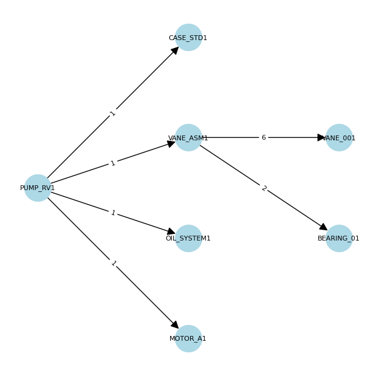

# core


<!-- WARNING: THIS FILE WAS AUTOGENERATED! DO NOT EDIT! -->

------------------------------------------------------------------------

<a href="https://github.com/janhesse53/bom/blob/main/bom/core.py#L15"
target="_blank" style="float:right; font-size:smaller">source</a>

### get_sample_data

>  get_sample_data ()

*Return sample BOM data (df) and item attributes (df_attributes) for
demonstration purposes.*

``` python
df, df_attributes = get_sample_data()
```

At this point, we have:

- `df` – Bill of Materials table (predecessor, successor, quantity)
- `df_attributes` – Item attributes table (component_type, cost, etc.)

------------------------------------------------------------------------

## Core Functions

We create one large directed graph containing **all** nodes and edges
from `df`. For node attributes, we can optionally merge data from
`df_attributes`.

------------------------------------------------------------------------

<a href="https://github.com/janhesse53/bom/blob/main/bom/core.py#L133"
target="_blank" style="float:right; font-size:smaller">source</a>

### build_complete_graph

>  build_complete_graph (df, df_attributes=None)

*Build a directed graph (DiGraph) from the BOM DataFrame. Optionally
enrich nodes with attributes from df_attributes.*

``` python
G = build_complete_graph(df, df_attributes)

print("Number of nodes:", G.number_of_nodes())
print("Number of edges:", G.number_of_edges())
```

    Number of nodes: 20
    Number of edges: 21

If we want to see which assemblies or products contain a given part, we
can **move upwards** in the graph (following edges backwards).

------------------------------------------------------------------------

<a href="https://github.com/janhesse53/bom/blob/main/bom/core.py#L160"
target="_blank" style="float:right; font-size:smaller">source</a>

### get_all_predecessors

>  get_all_predecessors (G, node_id)

*Return a list of all predecessors (ancestors) of `node_id`. This
effectively finds all assemblies or parent items that contain
`node_id`.*

Now, we can answer questions like: \> Where is component ‘MOTOR_A1’
installed?

``` python
get_all_predecessors(G, 'MOTOR_A1')
```

    ['PUMP_RV1', 'PUMP_RV2', 'PUMP_CL1']

Similarly, we can move **down** the graph to find all sub-components or
child items of a given product or assembly.

------------------------------------------------------------------------

<a href="https://github.com/janhesse53/bom/blob/main/bom/core.py#L176"
target="_blank" style="float:right; font-size:smaller">source</a>

### get_all_successors

>  get_all_successors (G, node_id)

*Return a list of all successors (descendants) of `node_id`. This
effectively finds the complete set of parts that make up `node_id`.*

Now, we can answer questions like: \> What component are installed in
‘PUMP_RV1’?

``` python
get_all_successors(G, 'PUMP_RV1')
```

    ['MOTOR_A1', 'CASE_STD1', 'VANE_ASM1', 'OIL_SYSTEM1', 'VANE_001', 'BEARING_01']

We can select a sub_graph by giving a root node and then searching for
all successors.

------------------------------------------------------------------------

<a href="https://github.com/janhesse53/bom/blob/main/bom/core.py#L192"
target="_blank" style="float:right; font-size:smaller">source</a>

### select_subg_by_root

>  select_subg_by_root (G, root_id)

``` python
sub_g = select_subg_by_root(G, 'PUMP_RV1')
sub_g.nodes()
```

    NodeView(('CASE_STD1', 'VANE_001', 'BEARING_01', 'VANE_ASM1', 'PUMP_RV1', 'OIL_SYSTEM1', 'MOTOR_A1'))

For a **multipartite** (hierarchical) layout in NetworkX, each node must
have a `level` attribute. The “level” is typically “0” for a root
product, “1” for its direct children, “2” for those children’s children,
etc. This function automatically detects the root(s) (any node with no
incoming edges) and assigns levels by breadth-first search.

------------------------------------------------------------------------

<a href="https://github.com/janhesse53/bom/blob/main/bom/core.py#L198"
target="_blank" style="float:right; font-size:smaller">source</a>

### add_levels

>  add_levels (G)

*Calculate levels starting from root*

``` python
sub_g = add_levels(sub_g)
[(n[0],n[1]['level']) for n in sub_g.nodes(data=True)]
```

    [('CASE_STD1', 1),
     ('VANE_001', 2),
     ('BEARING_01', 2),
     ('VANE_ASM1', 1),
     ('PUMP_RV1', 0),
     ('OIL_SYSTEM1', 1),
     ('MOTOR_A1', 1)]

The depth of the bill of materials can give us information about the
depth of added value per product.

``` python
max([n[1]['level'] for n in sub_g.nodes(data=True)])
```

    2

## Visualizing

Finally, we create a plotting function that can handle:

- Either a **multipartite** layout (if levels are assigned)
- Or a **kamada_kawai** layout (force-directed)

We also display edge attributes (`quantity`), and we allow parameter
overrides (font size, node size, color, etc.) for quick styling changes.

    /opt/hostedtoolcache/Python/3.10.16/x64/lib/python3.10/site-packages/fastcore/docscrape.py:230: UserWarning: Unknown section Parameters:
      else: warn(msg)

------------------------------------------------------------------------

<a href="https://github.com/janhesse53/bom/blob/main/bom/core.py#L218"
target="_blank" style="float:right; font-size:smaller">source</a>

### plot_graph

>  plot_graph (G, layout='multipartite', figsize=(6, 6), font_size=8,
>                  node_size=1000, node_color='lightblue')

*Plot a directed graph with the specified layout and styling.*

``` python
plot_graph(sub_g)
```


